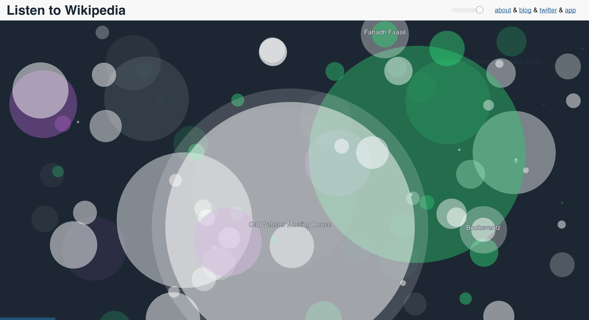

autoscale: true
build-lists: true
footer: Jonathan Dinu // Moogfest // May 22nd, 2016 // @jonathandinu

## Data Sonification
#### (with p5.js)

### __Moogfest__

#### [https://github.com/Jay-Oh-eN/data-sonification](https://github.com/Jay-Oh-eN/data-sonification)

---

# `whoami`

* [http://hopelessoptimism.com](http://hopelessoptimism.com)
* _@jonathandinu_
* jondinu@gmail.com

---

# `whatami`

---

## Data Sonification

---

## What isn't it

[http://therewasaguy.github.io/p5-music-viz/demos/08_echonestPitchSegment/](http://therewasaguy.github.io/p5-music-viz/demos/08_echonestPitchSegment/)

---

## Data as Medium

---

## What is it

^ http://www.teralab.co.uk/Electronics/Geiger/Geiger_Page1.htm

---

## What is it

^ [http://footage.framepool.com/en/shot/376893397-geiger-counter-nuclear-accident-prypyat-chernobyl-disaster](http://footage.framepool.com/en/shot/376893397-geiger-counter-nuclear-accident-prypyat-chernobyl-disaster)

---

## What it is

#### [https://vimeo.com/118358642](https://vimeo.com/118358642)

^ http://hyperallergic.com/180725/data-driven-music-to-for-the-disharmony-of-new-yorks-income-inequality/)

---

## What is it

#### [#tweetscapes](http://heavylistening.com/tweetscapes/)

---

## What is it

#### [http://listen.hatnote.com/](http://listen.hatnote.com/)

---

^https://fathom.info/notebook/8349/

---

## Why P5?

* Easy to Learn
* Easy to Program
* Easy to Share

* > Integrated Media
> (Audio, Graphics, Data, Events/Interaction, etc.)

^https://fathom.info/notebook/8349/

---

## What is it Good For

---

## So it's like Data Visualization?

---

## First... A Data Primer

---

## Categorical

---

## Continuous

---

## Marks and Channels

---

## Analogues

 Visual -> Audio

_Double encoding_ -> _Chords_
_Color_ -> _Timbre_
_Scaling (x-y position)_ -> _Pitch_
_Glyph_ -> _Beat_
_Shape_ -> _Instrumentation_

---

## So it's like writing a Song!

---

## Continuous Data are Our Melody

---

## Discrete Data are Our Rhythm (and Percussion)

---

## How??!

---

## Why _not_ P5?

* Difficult to Embed (Needs to Run in a Browser)
* Realtime Strained
* Hardware Interface Lacking

---

## _Data!_

* [NASA Climate Data](http://climate.nasa.gov/vital-signs/carbon-dioxide/)
* [Prince's Studio Albums (Wikipedia)](https://docs.google.com/spreadsheets/d/1FiPbFhuHwVu4NSbeZWFGDh4XsZ0JGT1LDGl9p0QSzzc)
* [Quandl (Financial)](https://www.quandl.com)
* [SF Evictions](https://data.sfgov.org/Housing-and-Buildings/Eviction-Notices/5cei-gny5)
* [treasury.io](http://treasury.io/)

---

[Synthetic Skyline](http://johnkeston.com/news/synthetic-skyline/#more-463)

---

You've gone too far

[^2]: http://www.slideshare.net/dmitrymakarchuk/linzer-slidesbarug-16844562
